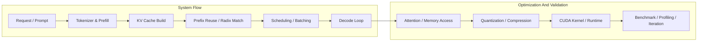

# KOO SHWAH

### ProIg-Chaa

**Software Engineering Student building efficient, understandable LLM systems**

`LLM Inference` `KV Cache` `Prefix Reuse` `Quantization` `CUDA`

<a href="https://github.com/ProIg-Chaa">GitHub</a> ·
<a href="https://github.com/ProIg-Chaa?tab=repositories">Projects</a> ·
<a href="#-中文">中文</a> ·
<a href="#-english">English</a>

---

## 中文

### 关于我

你好，我是 **KOO SHWAH**，华南理工大学软件工程专业学生，GitHub 用户名是 **ProIg-Chaa**。

我主要在做两类事情：

- 把大模型推理系统做得更高效，例如 `KV Cache`、`Prefix Reuse`、调度与 serving
- 把底层实现做得更清楚，例如 `Quantization`、`CUDA`、可复现实验和 benchmark

我更喜欢把论文里的思路做成能跑、能测、能继续演化的小系统，而不是只停留在概念层面。

### 当前重点

- 轻量 LLM inference / serving 系统
- Prefix-aware scheduling 与 cache reuse
- 量化、压缩与性能基准测试
- CUDA operator 与底层工程实践

### 我正在学习和推进的技术链

我希望自己理解的不只是某一个优化点，而是 **从请求进入系统，到 token 生成出来，再到底层 kernel 执行** 的整条链路。

### 技术重点展开

| Layer | What I focus on | Why it matters |
| --- | --- | --- |
| Prefill / Decode | 理解 prefill 和 decode 的开销结构差异 | 很多优化要先分清瓶颈究竟在计算、访存还是调度 |
| KV Cache | cache layout、复用策略、生命周期管理 | 这是长上下文和高吞吐推理系统里的核心部件 |
| Prefix Reuse | radix tree、prefix match、partial-tail reuse | 它直接影响重复前缀场景下的 latency 和吞吐 |
| Scheduling | continuous batching、prefix-aware scheduling | 调度策略会决定系统是否真的把 cache reuse 吃满 |
| Quantization | weight / KV cache quantization、精度与性能权衡 | 影响显存占用、带宽压力和系统可部署性 |
| CUDA / Kernel | 自定义 operator、内存访问模式、benchmark | 到这里才能真正看懂优化有没有落到硬件层 |
| Benchmarking | TTFT、throughput、latency、memory、复现性 | 没有统一 benchmark，很多“优化”很难真正比较 |

### 我更关心的问题

- 一个推理优化到底改善了哪一层，是 `compute-bound`、`memory-bound` 还是 `scheduler-bound`
- 一个 cache / quantization 方案是否真的能在真实 serving 流程里稳定受益
- 一个工程实现是否既能跑得快，也能被别人读懂、修改和继续扩展

### 我现在参与的工作

我目前也在参与 **多模态大模型隐式推理优化** 相关工作。

这类工作里，我关注的不只是模型是否“会推理”，更关心：

- 隐式推理过程能否在不过度增加 latency 和 memory pressure 的前提下稳定发生
- 多模态输入进入系统后，文本 token、视觉特征与推理链路之间的开销如何分布
- 推理优化能否真正落到工程系统里，而不只是停留在离线实验结果

我尤其在意这几个方向：

- **推理效率**：降低 multimodal prefilling、cross-modal interaction 和 decode 的额外成本
- **系统协同**：把推理优化和 cache reuse、batching、调度、压缩一起看，而不是孤立分析
- **效果-开销权衡**：分析准确性、推理深度、响应速度与资源消耗之间的平衡关系

这也让我把自己的兴趣，从单模态 LLM inference，逐步延伸到 **面向真实场景的多模态推理系统优化**。

### Featured Projects

| Project | Focus | What it shows |
| --- | --- | --- |
| [nano-radix-vllm](https://github.com/ProIg-Chaa/nano-radix-vllm) | Prefix reuse, radix-style cache, lightweight serving | 我在逐步把 prefix-aware 推理能力做进一个更容易理解的小型框架 |
| [llm-quant-benchmark](https://github.com/ProIg-Chaa/llm-quant-benchmark) | Quantization benchmark | 我会把 `FP16` / `INT8` / `INT4` / `AWQ` / `GPTQ` 放进统一流程下做可复现对比 |
| [cuda-oplib](https://github.com/ProIg-Chaa/cuda-oplib) | CUDA operators, tests, benchmark scaffold | 我在搭建一个适合长期做 kernel 实验和 PyTorch 绑定的基础工程 |
| [turboquant-pytorch-learning](https://github.com/ProIg-Chaa/turboquant-pytorch-learning) | KV cache compression, HF integration | 我会把论文/实验代码整理成更清晰、更接近真实使用场景的接口 |

### 我希望这个主页传达什么

- 我在认真做 **高效 LLM 系统**，不是泛泛而谈 AI
- 我的项目偏 **系统实现 + 工程演化 + 可复现实验**
- 我会持续把学习过程沉淀成 **可以被别人读懂和复用** 的仓库

### 学习路线可视化

| Direction | Current State |
| --- | --- |
| LLM inference pipeline | `Learning deeply` |
| KV cache / prefix reuse | `Building actively` |
| Quantization benchmark | `Organizing systematically` |
| CUDA operator / kernel practice | `Strengthening steadily` |
| Reproducible systems experiments | `Long-term focus` |

### Tech Stack

`Python` `PyTorch` `CUDA` `C++` `CMake` `Transformers` `Benchmarking` `LLM Serving`

### Looking For

- 有意思的 LLM inference / systems discussions
- Prefix cache、serving、quantization 方向的交流
- 一起做小而扎实的工程实验

### Contact

- GitHub: [@ProIg-Chaa](https://github.com/ProIg-Chaa)

---

## English

### About Me

Hi, I'm **KOO SHWAH**, a Software Engineering student at South China University of Technology, and my GitHub handle is **ProIg-Chaa**.

I mainly work on two kinds of problems:

- Making LLM inference systems more efficient with better cache reuse, scheduling, and serving design
- Making low-level implementations more understandable through quantization experiments, CUDA work, and reproducible benchmarks

I enjoy turning research ideas into small but real systems that are runnable, measurable, and easy to iterate on.

### Current Focus

- Lightweight LLM inference and serving systems
- Prefix-aware scheduling and KV cache reuse
- Quantization, compression, and benchmarking
- CUDA operators and low-level systems engineering

### The Technical Chain I Am Studying

I do not want to understand only isolated optimization tricks. I want to understand the **full path from an incoming request to generated tokens and finally to low-level kernel execution**.

### Focus Areas In Detail

| Layer | What I focus on | Why it matters |
| --- | --- | --- |
| Prefill / Decode | Understanding the different cost structures of prefill and decode | Many optimizations only make sense after the bottleneck is clearly identified |
| KV Cache | Cache layout, reuse strategy, and lifetime management | This is central to long-context and high-throughput inference systems |
| Prefix Reuse | Radix trees, prefix match, and partial-tail reuse | It strongly affects latency and throughput in repeated-prefix workloads |
| Scheduling | Continuous batching and prefix-aware scheduling | Scheduling determines whether reuse actually translates into system gains |
| Quantization | Weight and KV cache quantization, plus accuracy-performance tradeoffs | This affects memory footprint, bandwidth pressure, and deployment practicality |
| CUDA / Kernel | Custom operators, memory access patterns, and benchmarking | This is where system ideas finally meet the hardware |
| Benchmarking | TTFT, throughput, latency, memory, and reproducibility | Without a solid benchmark setup, optimization claims are hard to trust |

### Questions I Care About

- Which layer an optimization really improves: `compute-bound`, `memory-bound`, or `scheduler-bound`
- Whether a cache or quantization idea still helps inside a realistic serving pipeline
- Whether a system is not only fast, but also understandable and extensible

### Work I Am Doing Now

I am also participating in work on **implicit reasoning optimization for multimodal large models**.

What matters to me here is not only whether a model can reason, but whether that reasoning can be made efficient, stable, and system-friendly in practice.

- **Reasoning efficiency**: reducing the extra cost of multimodal prefilling, cross-modal interaction, and decoding
- **System integration**: understanding how reasoning optimization interacts with cache reuse, batching, scheduling, and compression
- **Quality-cost tradeoffs**: studying the balance among reasoning depth, response quality, latency, and resource use

This direction naturally extends my focus from single-modal LLM inference toward **practical multimodal reasoning system optimization**.

### Featured Projects

| Project | Focus | What it shows |
| --- | --- | --- |
| [nano-radix-vllm](https://github.com/ProIg-Chaa/nano-radix-vllm) | Prefix reuse, radix-style cache, lightweight serving | I am incrementally building prefix-aware inference ideas into a smaller and more understandable framework |
| [llm-quant-benchmark](https://github.com/ProIg-Chaa/llm-quant-benchmark) | Quantization benchmark | I compare `FP16` / `INT8` / `INT4` / `AWQ` / `GPTQ` with a unified and reproducible evaluation pipeline |
| [cuda-oplib](https://github.com/ProIg-Chaa/cuda-oplib) | CUDA operators, tests, benchmark scaffold | I am building a long-term base project for kernel experiments and PyTorch bindings |
| [turboquant-pytorch-learning](https://github.com/ProIg-Chaa/turboquant-pytorch-learning) | KV cache compression, HF integration | I refactor paper or experimental logic into cleaner interfaces closer to real usage |

### What I Want This Profile To Say

- I care about **efficient LLM systems**, not generic AI branding
- My work is centered on **systems implementation, engineering evolution, and reproducible experiments**
- I want my repositories to be **useful, readable, and extensible** for other builders

### Learning Roadmap

| Direction | Current State |
| --- | --- |
| LLM inference pipeline | `Learning deeply` |
| KV cache / prefix reuse | `Building actively` |
| Quantization benchmark | `Organizing systematically` |
| CUDA operator / kernel practice | `Strengthening steadily` |
| Reproducible systems experiments | `Long-term focus` |

### Tech Stack

`Python` `PyTorch` `CUDA` `C++` `CMake` `Transformers` `Benchmarking` `LLM Serving`

### Open To

- Conversations around LLM inference and systems work
- Discussions on prefix cache, serving, and quantization
- Small but serious engineering collaborations

### Contact

- GitHub: [@ProIg-Chaa](https://github.com/ProIg-Chaa)

---

`Still learning.` `Still building.` `Still making LLM systems easier to understand.`

