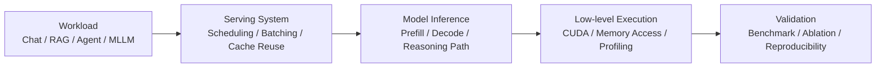

# KOO SHWAH

### ProIg-Chaa

**Software Engineering Student focused on efficient LLM / MLLM inference systems**

`LLM Inference` `KV Cache` `Prefix / Segment Reuse` `Agent Workloads` `MLLM Reasoning` `CUDA`

<a href="https://github.com/ProIg-Chaa">GitHub</a> ·
<a href="https://github.com/ProIg-Chaa?tab=repositories">Projects</a> ·
<a href="#-中文">中文</a> ·
<a href="#-english">English</a>

---

## 中文

### 关于我

你好，我是 **KOO SHWAH**，华南理工大学软件工程专业学生，GitHub 用户名是 **ProIg-Chaa**。

我目前关注的核心问题是：

> 如何让大模型在真实推理场景中更高效、更稳定、更容易被理解和复现。

我的兴趣集中在 **LLM / MLLM 推理系统优化**，包括 `KV Cache`、`Prefix / Segment Reuse`、serving 调度、量化压缩、CUDA kernel、benchmark，以及多模态推理过程中的效率与稳定性问题。

我更希望把研究想法落到可以运行、可以测量、可以继续演化的系统里，而不是只停留在 prompt、概念或离线指标层面。

### 当前重点

- 面向 LLM / MLLM 的轻量推理与 serving 系统
- KV cache、prefix reuse、segment-level context reuse
- Agent / RAG / multi-turn workload 下的上下文复用与性能分析
- 推理质量、输出长度、latency、memory 之间的权衡
- CUDA operator、profiling、benchmark 与可复现实验

### 我的主线

我希望把自己的工作统一到一条主线上：

> 面向多模态与 Agent 场景的大模型推理系统优化：从 CUDA kernel、KV cache、serving 调度，到 reasoning path 的效率与稳定性分析。

这条主线连接了三个层面：

```mermaid
flowchart LR
    A[Workload<br/>Chat / RAG / Agent / MLLM] --> B[Serving System<br/>Scheduling / Batching / Cache Reuse]
    B --> C[Model Inference<br/>Prefill / Decode / Reasoning Path]
    C --> D[Low-level Execution<br/>CUDA / Memory Access / Profiling]
    D --> E[Validation<br/>Benchmark / Ablation / Reproducibility]
```

### 我正在研究的问题

| Area | Questions I care about | Why it matters |
| --- | --- | --- |
| Prefill / Decode | prefill 和 decode 的瓶颈分别来自计算、访存还是调度？ | 不同瓶颈需要完全不同的优化方法 |
| KV Cache | cache layout、block 管理、生命周期和复用粒度如何设计？ | KV cache 是长上下文和高吞吐推理系统的核心资源 |
| Context Reuse | 从 prefix reuse 扩展到 segment / cross-turn / cross-agent reuse 是否可行？ | Agent、RAG、多轮对话里的重复上下文不一定只出现在开头 |
| Scheduling | continuous batching、cache-aware scheduling 如何真正转化为吞吐收益？ | 好的缓存策略如果调度吃不满，系统收益会被抵消 |
| MLLM Reasoning | 多模态推理中视觉信息什么时候有效、什么时候变成额外开销？ | MLLM 的问题不只是准确率，也包括 latency、memory 和稳定性 |
| Quantization / Compression | weight / KV cache quantization 如何影响精度、显存和带宽？ | 推理部署绕不开质量与成本的权衡 |
| CUDA / Kernel | 优化是否真正落到了 memory access、occupancy、bandwidth 或 launch overhead 上？ | 只有进入 profiling 层，才能判断优化是否真实有效 |
| Benchmarking | 如何同时报告 TTFT、TPOT、throughput、memory、accuracy、failure modes？ | 没有可复现 benchmark，很多系统优化无法比较 |

### 多模态推理方向

我也在参与 **多模态大模型隐式推理优化** 相关工作。

我更关心的不只是模型“能不能推理”，而是：

- 推理过程是否能被观测、量化和解释
- 视觉信息是否真的在关键阶段被使用
- 隐式推理是否降低了显式 token 成本
- routing / latent reasoning / visual injection 是否能跨数据集稳定迁移
- 准确率提升是否值得额外的 latency 和 memory pressure

因此，我会把 MLLM reasoning 放在系统视角下看：不仅分析 accuracy，也分析输出长度、截断率、失败类型、推理阶段、prefill/decode 成本和整体 serving 影响。

### Featured Projects

| Project | Focus | What it shows |
| --- | --- | --- |
| [nano-radix-vllm](https://github.com/ProIg-Chaa/nano-radix-vllm) | Prefix reuse, radix-style cache, lightweight serving | 我在尝试把 cache-aware inference 做成一个更小、更容易理解的系统原型 |
| [llm-quant-benchmark](https://github.com/ProIg-Chaa/llm-quant-benchmark) | Quantization benchmark | 我会把 `FP16` / `INT8` / `INT4` / `AWQ` / `GPTQ` 放进统一流程下做可复现对比 |
| [cuda-oplib](https://github.com/ProIg-Chaa/cuda-oplib) | CUDA operators, tests, benchmark scaffold | 我在搭建一个适合长期做 kernel 实验、PyTorch 绑定和 profiling 的基础工程 |
| [turboquant-pytorch-learning](https://github.com/ProIg-Chaa/turboquant-pytorch-learning) | KV cache compression, HF integration | 我会把论文/实验逻辑整理成更清晰、更接近真实使用场景的接口 |

### 正在形成的工程能力

- 读懂 LLM serving pipeline，而不是只调用 API
- 从 request lifecycle 视角分析 prefill、decode、cache、scheduler 的关系
- 用 benchmark 和 profiling 判断优化是否真实有效
- 将论文想法改造成可复现的小型系统
- 在 MLLM reasoning 实验中同时关注质量、成本和失败模式
- 使用 coding agents 辅助读代码、改实验、整理结果，但保留人工 review 和测试纪律

### 技术栈

`Python` `PyTorch` `CUDA` `C++` `CMake` `Transformers` `LLM Serving` `Benchmarking` `Profiling`

### 接下来我想推进的方向

- Agent / RAG workload 下的 KV cache 复用与性能分析
- prefix reuse 到 segment-level context reuse 的小型原型
- vLLM / SGLang / LMCache 相关 serving 机制学习与实验
- CUDA kernel 与 Nsight profiling 能力建设
- MLLM reasoning 方法的机制分析、失败模式分析与成本收益评估

### Looking For

- LLM inference、KV cache、serving systems 方向的交流
- Agent / RAG workload 下 context reuse 与推理效率相关讨论
- MLLM reasoning efficiency / stability 方向的合作或建议
- 小而扎实、可复现、可继续演化的工程实验

### 博客

- 对于中文读者，我整理了一些个人的学习笔记在*[@Chaa的AI学习笔记](https://proig-chaa.github.io/)*

### Contact

- GitHub: [@ProIg-Chaa](https://github.com/ProIg-Chaa)

---

## English

### About Me

Hi, I'm **KOO SHWAH**, a Software Engineering student at South China University of Technology, and my GitHub handle is **ProIg-Chaa**.

I focus on one core problem:

> How to make large model inference more efficient, stable, understandable, and reproducible in realistic workloads.

My current interests are centered around **LLM / MLLM inference system optimization**, including `KV Cache`, `Prefix / Segment Reuse`, serving scheduling, quantization, CUDA kernels, benchmarking, and the efficiency-stability tradeoffs in multimodal reasoning.

I enjoy turning research ideas into small but real systems that are runnable, measurable, and easy to iterate on.

### Current Focus

- Lightweight LLM / MLLM inference and serving systems
- KV cache, prefix reuse, and segment-level context reuse
- Context reuse and performance analysis under Agent / RAG / multi-turn workloads
- Tradeoffs among reasoning quality, output length, latency, and memory
- CUDA operators, profiling, benchmarking, and reproducible experiments

### My Technical Thread

I try to connect my work into one technical direction:

> Inference system optimization for multimodal and agentic workloads, spanning CUDA kernels, KV cache, serving scheduling, and reasoning-path efficiency.

```mermaid
flowchart LR
    A[Workload<br/>Chat / RAG / Agent / MLLM] --> B[Serving System<br/>Scheduling / Batching / Cache Reuse]
    B --> C[Model Inference<br/>Prefill / Decode / Reasoning Path]
    C --> D[Low-level Execution<br/>CUDA / Memory Access / Profiling]
    D --> E[Validation<br/>Benchmark / Ablation / Reproducibility]
```

### Questions I Care About

| Area | Questions I care about | Why it matters |
| --- | --- | --- |
| Prefill / Decode | Is the bottleneck compute, memory, or scheduling? | Different bottlenecks require different optimization strategies |
| KV Cache | How should cache layout, block management, lifetime, and reuse granularity be designed? | KV cache is a core resource in long-context and high-throughput inference |
| Context Reuse | Can we move from prefix reuse to segment / cross-turn / cross-agent reuse? | Repeated context in Agent and RAG workflows is often not limited to prefixes |
| Scheduling | How do continuous batching and cache-aware scheduling translate into real throughput gains? | A cache design only matters if the runtime can exploit it |
| MLLM Reasoning | When does visual information help, and when does it become extra cost? | MLLMs should be evaluated by quality, latency, memory, and stability together |
| Quantization / Compression | How do weight and KV cache quantization affect accuracy, memory, and bandwidth? | Deployment requires explicit quality-cost tradeoff analysis |
| CUDA / Kernel | Does an optimization improve memory access, occupancy, bandwidth, or launch overhead? | Profiling is necessary to know whether an optimization is real |
| Benchmarking | How should TTFT, TPOT, throughput, memory, accuracy, and failure modes be reported together? | Without reproducible benchmarks, system claims are hard to compare |

### Multimodal Reasoning Work

I am also working on **implicit reasoning optimization for multimodal large models**.

What matters to me is not only whether a model can reason, but whether the reasoning process can be observed, measured, and made efficient in practice.

I care about:

- whether visual information is actually used during key generation stages
- whether implicit reasoning can reduce explicit token cost
- whether routing, latent reasoning, or visual injection strategies transfer across datasets
- whether accuracy gains justify additional latency and memory pressure
- how reasoning optimization interacts with cache reuse, batching, compression, and serving

I therefore study MLLM reasoning from a systems perspective: not only accuracy, but also output length, truncation rate, failure modes, inference stage, prefill/decode cost, and serving impact.

### Featured Projects

| Project | Focus | What it shows |
| --- | --- | --- |
| [nano-radix-vllm](https://github.com/ProIg-Chaa/nano-radix-vllm) | Prefix reuse, radix-style cache, lightweight serving | I am building a small and understandable prototype for cache-aware inference |
| [llm-quant-benchmark](https://github.com/ProIg-Chaa/llm-quant-benchmark) | Quantization benchmark | I compare `FP16` / `INT8` / `INT4` / `AWQ` / `GPTQ` under a unified and reproducible evaluation pipeline |
| [cuda-oplib](https://github.com/ProIg-Chaa/cuda-oplib) | CUDA operators, tests, benchmark scaffold | I am building a long-term base for kernel experiments, PyTorch bindings, and profiling |
| [turboquant-pytorch-learning](https://github.com/ProIg-Chaa/turboquant-pytorch-learning) | KV cache compression, HF integration | I refactor paper or experimental logic into cleaner interfaces closer to real usage |

### Engineering Skills I Am Building

- Understanding LLM serving pipelines instead of only calling APIs
- Analyzing prefill, decode, cache, and scheduler interactions from the request lifecycle
- Using benchmark and profiling to verify whether an optimization is real
- Turning research ideas into reproducible mini-systems
- Evaluating MLLM reasoning by quality, cost, and failure modes together
- Using coding agents to assist code reading, experimentation, and result analysis, while keeping human review and testing discipline

### Tech Stack

`Python` `PyTorch` `CUDA` `C++` `CMake` `Transformers` `LLM Serving` `Benchmarking` `Profiling`

### Next Directions

- KV cache reuse and performance analysis under Agent / RAG workloads
- A small prototype moving from prefix reuse toward segment-level context reuse
- Studying vLLM / SGLang / LMCache serving mechanisms through experiments
- CUDA kernel practice with Nsight-based profiling
- Mechanism analysis, failure mode analysis, and cost-benefit evaluation for MLLM reasoning methods

### Open To

- Conversations around LLM inference, KV cache, and serving systems
- Discussions on context reuse and inference efficiency under Agent / RAG workloads
- Collaboration or feedback on MLLM reasoning efficiency and stability
- Small, serious, reproducible engineering experiments

### Contact

- GitHub: [@ProIg-Chaa](https://github.com/ProIg-Chaa)

---

`Still learning.` `Still building.` `Still making inference systems easier to understand.`

